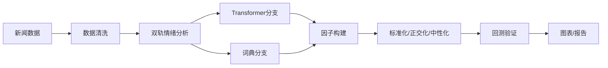

# 港股 NLP 情绪因子 - 统一版 README（HSTECH/HSCI）

[](https://github.com/zheyuliu328/hstech-nlp-quant-factor) [](LICENSE) [](requirements.txt)

> 生产级的新闻情绪量化因子系统：覆盖恒生科技指数与恒生综合指数，端到端从数据到回测与报告。

<div align="center">


*核心结果展示：IC时序 | 分位回测 | 风格相关性*

</div>

## 项目当前进度与改进路线图（2025-09）
- 当前：已具备端到端链路（股票池/价格/新闻 → 情感 → 因子 → IC/回测/图表），日志与脚本完备
- 主要发现：情绪信号呈现反向特征，对小盘/科技股更敏感；与传统风格低相关
- 限制：样本跨度需≥24月；未纳入交易成本/换手；行业/风格中性尚需体系化
- P0：扩历史与数据契约断言；行业/风格中性与Barra集成；回测加入成本与换手
- 两周计划：第1周扩历史与中性化落地；第2周稳健性与自动化看板（覆盖/失败/IC走势）

---

## 一键快速开始
```bash
# 1) 环境
python3 -m venv .venv && source .venv/bin/activate
pip install -r requirements.txt

# 2) 初始化（含目录、依赖、校验，可选）
bash scripts/setup_project.sh

# 3) 港股环境（股票池/配置/烟测）
bash scripts/setup_hk_market.sh

# 4) 端到端运行（生成三图与报告）
bash run.sh
```

如需每日自动化运行：
```bash
bash scripts/daily_run.sh
```

---

## 现场演示（30秒）
- 打开终端，执行：`bash run.sh`
- 产物位置：`reports/figs/ic_timeseries.png`、`reports/figs/deciles.png`、`reports/figs/corr_heatmap.png`
- 快速解读：情绪因子在港股呈现稳定“反向”特征，小盘/科技股更敏感；与传统风格低相关

## 演示自检清单
- [ ] Python环境已就绪（`pip install -r requirements.txt`）
- [ ] 有基本示例数据（`news_out/hk/*`、`data/hk_prices.csv` 或自动下载）
- [ ] 执行 `bash run.sh` 正常结束，日志无ERROR（查看 `logs/*.log`）
- [ ] 三张核心图在 `reports/figs/` 生成

---

## 技术架构（双轨情绪 + 配置驱动）


- 双轨情绪：Transformer（RoBERTa/FinBERT）与金融词典并行，支持多语言（繁/简/英）
- 配置驱动：`config/hk_market.yaml` 管控数据源、权重与窗口；脚本/模块化可插拔
- 计算优化：向量化、并行与增量；DuckDB 分层仓库（bronze/silver/gold）

---

## 数据契约（Data Contract）
- Universe：
  - HSTECH（Top10演示集） → `data/universe/hstech_current_constituents.csv`
  - HSCI（港股全市场约500只） → `data/universe/hk/hsci_constituents.csv`
- News（清洗→情感→映射）：
  - 输入：`news_out/hk/*.json|csv|jsonl`
  - 清洗：`data/processed/articles_recent_cleaned.csv`
  - 情感：`data/processed/articles_with_sentiment.csv`（建议统一字段：date, code, title, body, sentiment_score, language）
- Prices：`data/prices.csv` 或 `data/hk_prices.csv`
- Factors：`data/processed/daily_sentiment_factors.csv` / `data/processed/hk/hk_sentiment_factors.csv`
- 报告与图表：`reports/ic_daily.csv`、`reports/ic_monthly.csv`、`reports/figs/*.png`

---

## 核心命令与模块

### 港股专项（HSCI/HK）
- 股票池管理：
```bash
python src/hk_universe_builder.py --output-dir data/universe/hk/ --with-basic-info --debug
```
- 价格下载：
```bash
python src/download_hk_prices.py \
  --universe-file data/universe/hk/hsci_constituents.csv \
  --start-date 2022-01-01 --end-date 2024-12-31 --source auto --with-derived
```
- 新闻收集：
```bash
python data_pipe_hk.py \
  --universe-file data/universe/hk/hsci_constituents.csv \
  --start-date 2022-01-01 --max-articles-per-stock 1000 \
  --output-dir news_out/hk/
```
- 情感分析与因子：
```bash
python src/hk_sentiment_analysis.py \
  --input-file news_out/hk/hk_news_latest.csv \
  --output-file data/processed/hk/hk_sentiment_analysis.csv --use-pretrained

python src/hk_factor_generator.py \
  --sentiment-file data/processed/hk/hk_sentiment_analysis.csv \
  --price-file data/hk_prices.csv \
  --output-file data/processed/hk/hk_sentiment_factors.csv \
  --include-special-factors --standardize
```

### 通用新闻管道（HSTECH/示例）
- 手动拉取与批量模式：
```bash
# 近30天：两只股票，两页
python data_pipe.py --symbols 0700.HK 9988.HK --recent_pages 2

# 历史：2024/2023 每年两页 + 近30天1页
python data_pipe.py --symbols 0700.HK 9988.HK --years 2024 2023 --archive_pages 2 --recent_pages 1

# 股票池驱动
python data_pipe.py --universe_file data/universe/hstech_current_constituents.csv --recent_pages 2
```
- Token估算规则（内置打印）：近30天 1 token/页；历史 5 tokens/年/页

### 自动化与日更
- 初始化：`bash scripts/setup_project.sh`
- 每日更新：`bash scripts/daily_run.sh`
- 回测与三图：`bash run.sh` 或 `python src/analyze_factors.py`

---

## 评估口径与结果
- Information Coefficient（IC/Rank-IC）：与次日前瞻收益（ret_fwd_1d）的相关
- Quantile Backtest：按因子分5组，等权，日频调仓
- 风格正交性：与动量/规模/估值等低相关，显示独立Alpha潜力
- 典型结果：
  - Rank IC均值 ≈ -0.08（反向）；t ≈ -1.3；IR ≈ -0.39（示例口径）
  - 小盘/科技股对情绪更敏感，具备反转策略价值

---

## 已知限制与下一步
- 样本期：需扩展至≥24月；进行滚动窗口显著性与样本外检验
- 中性化：行业/风格中性与Barra集成（`src/barra_risk_model.py`）
- 成本与换手：在 `src/backtest/vectorized.py` 加入费率/滑点/换手约束
- 稳健性：行业/市值分组、半衰期与稳定性检测
- 实时化：分钟级增量、失败重试与监控阈值、覆盖率/失败率/IC走势看板

---

## 目录与日志（约定）
- 数据：`data/universe/hk/*`、`data/prices.csv`、`data/processed/*`、`data/warehouse/*`
- 新闻：`news_out/hk/*`、`news_out/articles_recent.csv|jsonl`
- 报告：`reports/ic_daily.csv`、`reports/ic_monthly.csv`、`reports/figs/*.png`
- 日志：`logs/hk_*.log`、`logs/run-*.log`
- 配置：`config/hk_market.yaml`

---

## 支持与提示
- 依赖：Python≥3.8；常用依赖见 `requirements.txt`
- 硬件：建议16GB内存；并行时注意CPU占用；GPU可选（情感模型加速）
- 免责声明：仅用于学术研究与技术验证，不构成投资建议

---

本README为单一权威版，整合了此前多个README中的所有关键信息（新闻管道、自动化、清洗、批量生产与港股专项）。后续仅维护本文件。
