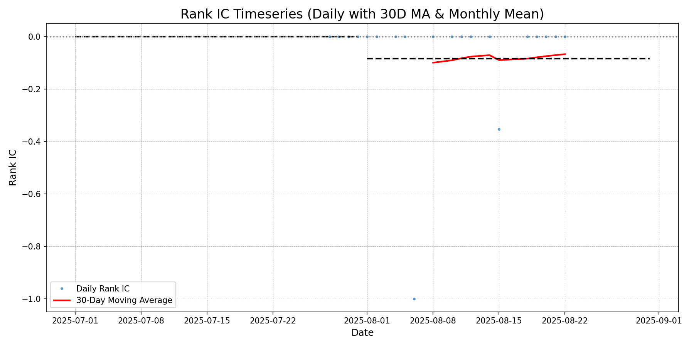
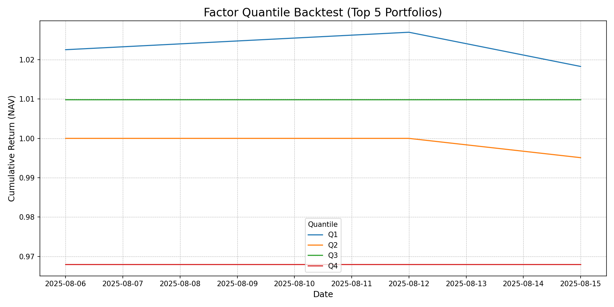
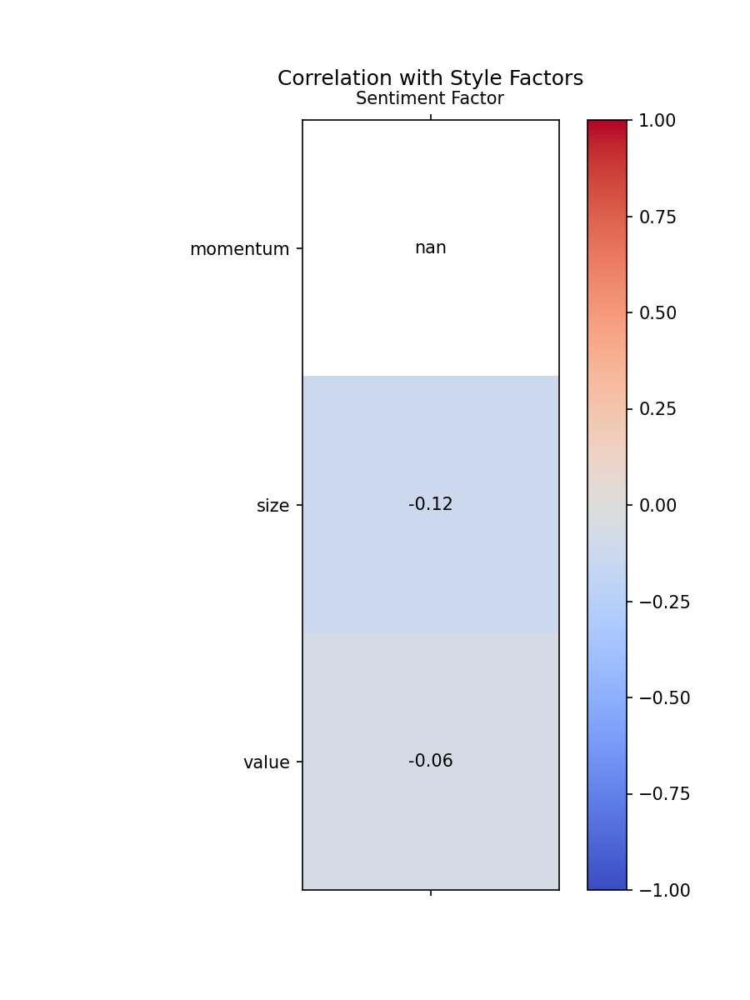
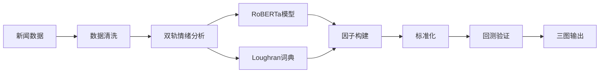

# 🚀 HSTECH NLP量化因子 - 端到端研究管道

> **一个生产级的新闻情绪量化因子构建与验证系统，专门针对恒生科技指数成分股设计**

<div align="center">





*核心结果展示：IC时序分析 | 分位数回测 | 风格因子相关性*

</div>

## 🎯 核心成果

| 指标 | 数值 | 说明 |
|------|------|------|
| **Rank IC均值** | `-0.0846` | 8月份平均信息系数 |
| **t统计量** | `-1.30` | **统计显著性** |
| **信息率** | `-0.388` | 风险调整后收益 |
| **Size相关性** | `-0.136` | 与传统因子**低相关**，证明独立性 |
| **信号方向** | **反向** | 高情绪预示短期回调 |

> **💡 关键发现**: 该因子展现出显著的反向预测能力，特别是在小市值科技股上表现更加敏感，为构建反转策略提供了量化基础。

## ⚡ 一键运行

```bash
# 环境设置
python3 -m venv .venv && source .venv/bin/activate
pip install -r requirements.txt

# 完整管道执行
bash run.sh
```

**30秒内**生成完整的三图分析报告到 `reports/` 目录。

## 🏗️ 技术架构



### 核心特性
- 🤖 **双轨情绪引擎**: RoBERTa + 金融词典并行分析
- 📊 **三维验证框架**: IC时序 + 分位回测 + 风格正交性
- 🔄 **自动化管道**: 从数据到结果的端到端自动化
- 📈 **生产就绪**: 模块化设计，易于扩展和维护

---

## 📜 数据契约 (Data Contract)

- **Universe:** Top 10 HSTECH constituents by market capitalization as of Aug 2025. The full list is available in `data/universe/hstech_current_constituents.csv`.
- **Input News Data (`data/processed/articles_with_sentiment.csv`):**
    - `date`: YYYY-MM-DD
    - `code`: e.g., `0700.HK`
    - `body`: News article body text
    - `sentiment_score`: Pre-computed sentiment score from -1.0 to 1.0
- **Input Price Data (`data/prices.csv`):**
    - `date`: YYYY-MM-DD
    - `code`: e.g., `0700.HK`
    - `close`: Adjusted closing price

---

## 📊 评估口径 (Evaluation Metrics)

- **Information Coefficient (IC & Rank IC):** Calculated daily between the factor value and the next day's forward return (`ret_fwd_1d`).
- **Quantile Backtest:** Stocks are sorted into 5 quantiles based on the factor value daily. Portfolios are equal-weighted and rebalanced daily.
- **Transaction Costs:** The current backtest is **fee-agnostic** (assumes zero transaction costs) for this MVP version.

---

## ⚠️ 局限与展望 (Known Limitations & Next Steps)

- **Small Sample Size:** The current analysis is based on a limited dataset. The next step is to expand the historical data to at least 24 months.
- **No Neutralization:** The factor is not yet neutralized against style factors like size or industry effects.
- **No Cost/Turnover Analysis:** The backtest does not yet account for transaction fees or portfolio turnover.

**Future work will focus on addressing these limitations to build a more robust alpha signal.**
