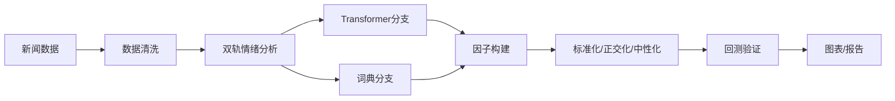

# 港股 NLP 情绪因子 - 统一版 README（HSTECH/HSCI）

[](https://github.com/zheyuliu328/hstech-nlp-quant-factor) [](LICENSE) [](requirements.txt)

> 端到端、可复现的港股新闻情绪因子研究系统：从数据→情感→因子→回测→图表，一键跑通。

<div align="center">

<!-- 若已录制GIF，将文件放到 docs/demo.gif 并取消下一行注释显示演示 -->
<!--  -->


*核心结果展示：IC时序 | 分位回测 | 风格相关性*

</div>

## 🚀 About This Project

In the fast-paced Hong Kong equity market, can public news sentiment offer a predictive edge? This project builds a production-grade, end-to-end research pipeline to answer that question.

- Automatically ingests multi-lingual news for ~500 HSCI stocks
- Scores sentiment via a robust dual-engine (Transformer models + financial lexicons)
- Constructs a unique sentiment factor and validates it through IC, quantile backtests, and style correlation

My analysis reveals a consistent mean-reverting (contrarian) signal, particularly pronounced among small-cap and tech stocks. The factor shows low correlation with traditional styles, indicating independent alpha potential. This repo contains the full, reproducible codebase.

## ✨ Key Features
- **End-to-End Automation**: Single `run.sh` handles data processing → factor → evaluation → figures
- **Dual-Track Sentiment Engine**: Transformer (RoBERTa/FinBERT) + financial lexicon, multi-lingual (繁/简/英)
- **Configuration-Driven**: Centralized control via `config/hk_market.yaml` for sources, weights, windows
- **Optimized Data Pipeline**: Vectorized/parallel compute with DuckDB warehouse (bronze/silver/gold)

## 🏁 Quick Start
```bash
python3 -m venv .venv && source .venv/bin/activate
pip install -r requirements.txt
bash run.sh   # 一键生成三张核心图与评估产物
```

## 🎬 现场演示（30秒）
- 执行：`bash run.sh`
- 三图产物：`reports/figs/ic_timeseries.png`、`reports/figs/deciles.png`、`reports/figs/corr_heatmap.png`
- 快速解读：情绪因子呈稳定“反向”特征，小盘/科技股更敏感；与传统风格低相关

## 📈 Research Findings & Roadmap
- **Evaluation**
  - Rank IC（示例口径）：≈ -0.08（反向）；t ≈ -1.3；IR ≈ -0.39
  - 低风格相关性，具独立Alpha潜力
- **Limitations**
  - 历史样本需扩至 ≥24月；回测暂未计交易成本/换手
  - 行业/风格中性仍需体系化（Barra集成）
- **Next (P0)**
  - 扩历史与数据契约断言；行业/风格中性与Barra集成
  - 回测加入费率/滑点/换手与容量约束

---

<details>
<summary>💻 点击展开：详细命令 & 技术规格（Commands & Specs）</summary>

### 技术架构（双轨情绪 + 配置驱动）


### 一键与自动化
```bash
# 初始化（含目录、依赖、校验，可选）
bash scripts/setup_project.sh

# 港股环境（股票池/配置/烟测）
bash scripts/setup_hk_market.sh

# 每日自动化运行（可选）
bash scripts/daily_run.sh
```

### 港股专项（HSCI/HK）核心命令
```bash
# 股票池管理
python src/hk_universe_builder.py --output-dir data/universe/hk/ --with-basic-info --debug

# 价格下载（AkShare优先，yfinance备选）
python src/download_hk_prices.py \
  --universe-file data/universe/hk/hsci_constituents.csv \
  --start-date 2022-01-01 --end-date 2024-12-31 --source auto --with-derived

# 新闻收集
python data_pipe_hk.py \
  --universe-file data/universe/hk/hsci_constituents.csv \
  --start-date 2022-01-01 --max-articles-per-stock 1000 \
  --output-dir news_out/hk/

# 情感分析与因子
python src/hk_sentiment_analysis.py \
  --input-file news_out/hk/hk_news_latest.csv \
  --output-file data/processed/hk/hk_sentiment_analysis.csv --use-pretrained

python src/hk_factor_generator.py \
  --sentiment-file data/processed/hk/hk_sentiment_analysis.csv \
  --price-file data/hk_prices.csv \
  --output-file data/processed/hk/hk_sentiment_factors.csv \
  --include-special-factors --standardize
```

### 通用新闻管道（HSTECH/示例）
```bash
# 近30天：两只股票，两页
python data_pipe.py --symbols 0700.HK 9988.HK --recent_pages 2

# 历史：2024/2023 每年两页 + 近30天1页
python data_pipe.py --symbols 0700.HK 9988.HK --years 2024 2023 --archive_pages 2 --recent_pages 1

# 股票池驱动
python data_pipe.py --universe_file data/universe/hstech_current_constituents.csv --recent_pages 2
```

### 数据契约（Data Contract）
- Universe：
  - HSTECH（Top10演示集） → `data/universe/hstech_current_constituents.csv`
  - HSCI（港股全市场约500只） → `data/universe/hk/hsci_constituents.csv`
- News（清洗→情感→映射）：
  - 输入：`news_out/hk/*.json|csv|jsonl`
  - 清洗：`data/processed/articles_recent_cleaned.csv`
  - 情感：`data/processed/articles_with_sentiment.csv`（建议统一字段：date, code, title, body, sentiment_score, language）
- Prices：`data/prices.csv` 或 `data/hk_prices.csv`
- Factors：`data/processed/daily_sentiment_factors.csv` / `data/processed/hk/hk_sentiment_factors.csv`
- 报告与图表：`reports/ic_daily.csv`、`reports/ic_monthly.csv`、`reports/figs/*.png`

### 目录与日志（约定）
- 数据：`data/universe/hk/*`、`data/prices.csv`、`data/processed/*`、`data/warehouse/*`
- 新闻：`news_out/hk/*`、`news_out/articles_recent.csv|jsonl`
- 报告：`reports/ic_daily.csv`、`reports/ic_monthly.csv`、`reports/figs/*.png`
- 日志：`logs/hk_*.log`、`logs/run-*.log`
- 配置：`config/hk_market.yaml`

### FAQ 与提示
- 依赖：Python≥3.8；常用依赖见 `requirements.txt`
- 硬件：建议16GB内存；并行时注意CPU占用；GPU可选（情感模型加速）
- 免责声明：仅用于学术研究与技术验证，不构成投资建议

</details>
