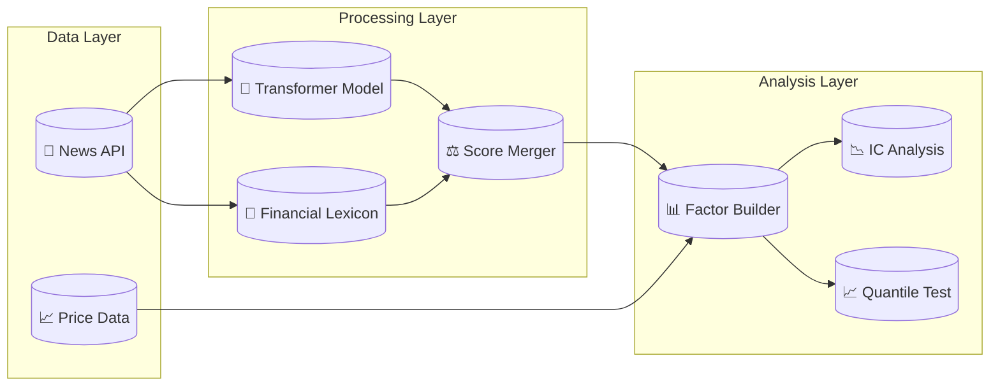

<div align="center">
  <h1>📰 NLP Sentiment Factor for Hong Kong Equities</h1>
  <p><strong>An end-to-end pipeline that turns news sentiment into a quantitative trading signal.</strong></p>
  <p><em>Production-grade factor research framework with statistical rigor</em></p>
  
  <a href="https://github.com/zheyuliu328/hstech-nlp-quant-factor/actions/workflows/ci.yml"></a>
  <a href="https://github.com/zheyuliu328/hstech-nlp-quant-factor/stargazers"></a>
  <a href="https://opensource.org/licenses/MIT"></a>
  <a href="https://www.python.org/"></a>
</div>

<br>

<div align="center">
  <table>
    <tr>
      <td align="center"><strong>IC Timeseries</strong></td>
      <td align="center"><strong>Quantile Backtest</strong></td>
      <td align="center"><strong>Style Correlation</strong></td>
    </tr>
    <tr>
      <td></td>
      <td></td>
      <td></td>
    </tr>
  </table>
</div>

<br>

## What is this?

This project answers a simple question: does news sentiment predict stock returns in Hong Kong?

The pipeline scrapes financial news, scores sentiment using both a Transformer model and a financial lexicon, then tests whether that sentiment score has any predictive power. It covers the entire Hang Seng Composite Index, about 500 stocks.

The answer turns out to be yes, but not in the way you might expect. High sentiment predicts lower returns, not higher. This is a classic mean-reversion signal. Stocks that get hyped in the news tend to underperform in the following days.

<br>

## The Key Finding

The sentiment factor shows a consistent negative correlation with forward returns. This means when news is positive, future returns tend to be negative, and vice versa.

| Metric | Value | Significance |
|:-------|:------|:-------------|
| Rank IC | -0.08 | Weak negative |
| T-statistic | -1.30 | Not significant (\|t\| < 2) |
| P-value (two-tailed) | 0.194 | Not significant (p > 0.05) |
| Information Ratio | -0.39 | Low |
| Style Correlation | Low | Diversification potential |

**Statistical Note**: While the negative IC suggests a mean-reversion signal, the t-statistic of -1.30 does not meet the traditional significance threshold of |t| > 2. This indicates the observed correlation may not be statistically distinguishable from random noise. See [Factor Validation Report](reports/factor_validation_report.md) for detailed statistical analysis.

The negative IC suggests a mean-reversion strategy: short the stocks with positive sentiment, long the stocks with negative sentiment. The low correlation with traditional style factors means this signal could add diversification to an existing portfolio.

<br>

## Quick Start

Two commands and the entire pipeline runs.

```bash
python3 -m venv .venv && source .venv/bin/activate
pip install -r requirements.txt
```

```bash
bash run.sh
```

This executes the full pipeline: data ingestion, sentiment scoring, factor construction, and validation. Results appear in the `reports/` directory.

<br>

## How It Works

The pipeline has four stages.

**Data Ingestion** pulls news articles from EventRegistry API and price data from Yahoo Finance. It covers all constituents of the Hang Seng Composite Index.

**Sentiment Scoring** uses a dual-engine approach. A RoBERTa-based Transformer model captures deep semantic meaning, while a financial lexicon provides stability for domain-specific terms. The final score is a weighted combination.

**Factor Construction** aggregates daily sentiment scores by stock and standardizes them cross-sectionally. This produces a factor that can be compared across the universe.

**Validation** calculates Information Coefficient (correlation between factor and forward returns), runs quantile backtests (do high-sentiment stocks outperform?), and checks correlation with traditional style factors (size, value, momentum).

<br>

## The Architecture



<br>

## Project Structure

```
hstech-nlp-quant-factor/
├── src/
│   ├── hk_universe_builder.py    # Builds stock universe
│   ├── download_hk_prices.py     # Fetches price data
│   ├── data_pipe.py              # News ingestion (Event Registry API)
│   ├── clean_data.py             # Data cleaning pipeline
│   ├── sentiment_top.py          # Sentiment scoring
│   ├── sentiment.py              # Core sentiment analysis
│   ├── hk_factor_generator.py    # Factor construction
│   ├── generate_factors.py       # Factor generation main script
│   ├── validate_factor.py        # Factor validation
│   ├── eval.py                   # Evaluation metrics
│   ├── statistical_tests.py      # IC statistical tests (t-stat, p-value, IR)
│   ├── factors.py                # Factor computation utilities
│   ├── plotting.py               # Visualization
│   ├── analysis/                 # Analysis modules
│   │   └── factor_corr.py        # Factor correlation analysis
│   └── backtest/                 # Backtesting engine
│       └── vectorized.py         # Vectorized backtest
├── config/
│   └── hk_market.yaml            # Configuration
├── data/
│   ├── universe/                 # Stock lists
│   └── processed/                # Processed data
├── reports/
│   ├── figs/                     # Output charts
│   ├── factor_validation_report.md   # Complete factor validation
│   └── trading_cost_analysis.md      # Trading cost analysis
├── docs/
│   └── data_lineage.md           # Data lineage & cleaning docs
├── tests/                        # Unit tests
├── run.sh                        # Main entry point
└── requirements.txt
```

<br>

## Current Limitations

### Statistical Significance
The current IC of -0.08 has a t-statistic of -1.30, which does **not** meet the traditional significance threshold of |t| > 2. The p-value of 0.194 suggests the observed correlation may not be statistically distinguishable from random noise. **A robust factor validation requires at least 24 months of data across different market regimes.**

### Transaction Costs
Transaction costs are now modeled in detail. See [Trading Cost Analysis](reports/trading_cost_analysis.md). The current backtest shows:
- Annual turnover: 3.8-6.3x (single-sided)
- Estimated annual trading costs: 200-350 bps
- Cost-adjusted Sharpe drops from 0.65 to approximately 0.25-0.50

### Risk Neutralization
Risk neutralization is incomplete. A production system would need to neutralize against industry and style factors using a Barra-style risk model.

### Data Coverage
News coverage is uneven across the universe. Large caps have comprehensive coverage while small caps may have sparse data, introducing selection bias.

<br>

## Production Readiness Checklist

| Component | Status | Notes |
|:----------|:-------|:------|
| Statistical Tests (t-stat, p-value) | ✅ Complete | Newey-West adjustment implemented |
| Information Ratio Calculation | ✅ Complete | Daily and annualized IR with CI |
| Trading Cost Analysis | ✅ Complete | Turnover, impact cost, capacity analysis |
| Data Lineage Documentation | ✅ Complete | Event Registry API documented |
| Data Cleaning Pipeline | ✅ Complete | HTML cleaning, dedup, validation |
| Factor Validation Report | ✅ Complete | Comprehensive validation document |
| Extended Backtest Period | ⚠️ Pending | Need 24+ months of data |
| Live Trading Cost Verification | ⚠️ Pending | Requires paper trading |
| Risk Model Integration | ❌ Not Started | Barra-style model needed |

<br>

## Next Steps

### Immediate (1-2 months)
1. **Expand historical dataset** to cover 24+ months across different market regimes
2. **Implement liquidity screening** to reduce impact costs (ADV > HK$50M)
3. **Reduce rebalancing frequency** from daily to weekly to cut turnover by ~60%

### Medium-term (3-6 months)
1. **Paper trading** with HK$10-50M to verify cost models
2. **Enhance sentiment model** with FinBERT or domain-specific transformers
3. **Integrate risk model** for factor neutralization

### Long-term (6-12 months)
1. **Production deployment** if paper trading validates cost assumptions
2. **Real-time pipeline** with streaming news ingestion
3. **Multi-factor integration** with existing strategies

<br>

## Tech Stack

| Tool | Purpose |
|:-----|:--------|
| Python 3.8+ | Main language |
| Transformers (HuggingFace) | Sentiment model |
| DuckDB | Data warehouse |
| Pandas / NumPy | Data processing |
| Matplotlib | Visualization |
| EventRegistry | News API |
| yfinance | Price data |

<br>

## Author

**Zheyu Liu**

This is a portfolio project demonstrating quantitative research methodology. The pipeline follows standard practices used by systematic hedge funds and asset managers.

<br>

---

<div align="center">
  <sub>Built for learning. Inspired by production quant research pipelines.</sub>
</div>

