<div align="center">
  <h1>📰 NLP Sentiment Factor for Hong Kong Equities</h1>
  <p><strong>An end-to-end pipeline that turns news sentiment into a quantitative trading signal.</strong></p>
  
  <a href="https://github.com/zheyuliu328/hstech-nlp-quant-factor/actions/workflows/ci.yml"></a>
  <a href="https://github.com/zheyuliu328/hstech-nlp-quant-factor/stargazers"></a>
  <a href="https://opensource.org/licenses/MIT"></a>
  <a href="https://www.python.org/"></a>
</div>

<br>

<div align="center">
  <table>
    <tr>
      <td align="center"><strong>IC Timeseries</strong></td>
      <td align="center"><strong>Quantile Backtest</strong></td>
      <td align="center"><strong>Style Correlation</strong></td>
    </tr>
    <tr>
      <td></td>
      <td></td>
      <td></td>
    </tr>
  </table>
</div>

<br>

## What is this?

This project answers a simple question: does news sentiment predict stock returns in Hong Kong?

The pipeline scrapes financial news, scores sentiment using both a Transformer model and a financial lexicon, then tests whether that sentiment score has any predictive power. It covers the entire Hang Seng Composite Index, about 500 stocks.

The answer turns out to be yes, but not in the way you might expect. High sentiment predicts lower returns, not higher. This is a classic mean-reversion signal. Stocks that get hyped in the news tend to underperform in the following days.

<br>

## The Key Finding

The sentiment factor shows a consistent negative correlation with forward returns. This means when news is positive, future returns tend to be negative, and vice versa.

| Metric | Value |
|:-------|:------|
| Rank IC | -0.08 |
| T-statistic | -1.3 |
| Information Ratio | -0.39 |
| Style Correlation | Low |

The negative IC suggests a mean-reversion strategy: short the stocks with positive sentiment, long the stocks with negative sentiment. The low correlation with traditional style factors means this signal could add diversification to an existing portfolio.

<br>

## Quick Start

Two commands and the entire pipeline runs.

```bash
python3 -m venv .venv && source .venv/bin/activate
pip install -r requirements.txt
```

```bash
bash run.sh
```

This executes the full pipeline: data ingestion, sentiment scoring, factor construction, and validation. Results appear in the `reports/` directory.

<br>

## How It Works

The pipeline has four stages.

**Data Ingestion** pulls news articles from EventRegistry API and price data from Yahoo Finance. It covers all constituents of the Hang Seng Composite Index.

**Sentiment Scoring** uses a dual-engine approach. A RoBERTa-based Transformer model captures deep semantic meaning, while a financial lexicon provides stability for domain-specific terms. The final score is a weighted combination.

**Factor Construction** aggregates daily sentiment scores by stock and standardizes them cross-sectionally. This produces a factor that can be compared across the universe.

**Validation** calculates Information Coefficient (correlation between factor and forward returns), runs quantile backtests (do high-sentiment stocks outperform?), and checks correlation with traditional style factors (size, value, momentum).

<br>

## The Architecture

```mermaid
graph LR
    subgraph "Data Layer"
        NEWS[("📰 News API")]
        PRICE[("📈 Price Data")]
    end

    subgraph "Processing Layer"
        NLP[("🤖 Transformer Model")]
        LEX[("📖 Financial Lexicon")]
        MERGE[("⚖️ Score Merger")]
    end

    subgraph "Analysis Layer"
        FACTOR[("📊 Factor Builder")]
        IC[("📉 IC Analysis")]
        QUANT[("📈 Quantile Test")]
    end

    NEWS --> NLP
    NEWS --> LEX
    NLP --> MERGE
    LEX --> MERGE
    MERGE --> FACTOR
    PRICE --> FACTOR
    FACTOR --> IC
    FACTOR --> QUANT
```



<br>

## Project Structure

```
hstech-nlp-quant-factor/
├── src/
│   ├── hk_universe_builder.py    # Builds stock universe
│   ├── download_hk_prices.py     # Fetches price data
│   ├── data_pipe.py              # News ingestion
│   ├── sentiment_top.py          # Sentiment scoring
│   ├── hk_factor_generator.py    # Factor construction
│   └── validate_factor.py        # IC and quantile tests
├── config/
│   └── hk_market.yaml            # Configuration
├── data/
│   ├── universe/                 # Stock lists
│   └── processed/                # Processed data
├── reports/
│   └── figs/                     # Output charts
├── run.sh                        # Main entry point
└── requirements.txt
```

<br>

## Current Limitations

The backtest period needs to be longer. A robust factor validation requires at least 24 months of data across different market regimes.

Transaction costs are not modeled. The current backtest assumes zero slippage and zero commissions, which overstates real-world performance.

Risk neutralization is incomplete. A production system would need to neutralize against industry and style factors using a Barra-style risk model.

<br>

## Next Steps

Expand the historical dataset to cover multiple market cycles. Implement data quality assertions to catch ingestion errors early.

Integrate a proper risk model for factor neutralization. This isolates the pure alpha from systematic exposures.

Add realistic transaction cost models. Hong Kong has stamp duty and relatively wide spreads for small caps.

<br>

## Tech Stack

| Tool | Purpose |
|:-----|:--------|
| Python 3.8+ | Main language |
| Transformers (HuggingFace) | Sentiment model |
| DuckDB | Data warehouse |
| Pandas / NumPy | Data processing |
| Matplotlib | Visualization |
| EventRegistry | News API |
| yfinance | Price data |

<br>

## Author

**Zheyu Liu**

This is a portfolio project demonstrating quantitative research methodology. The pipeline follows standard practices used by systematic hedge funds and asset managers.

<br>

---

<div align="center">
  <sub>Built for learning. Inspired by production quant research pipelines.</sub>
</div>

