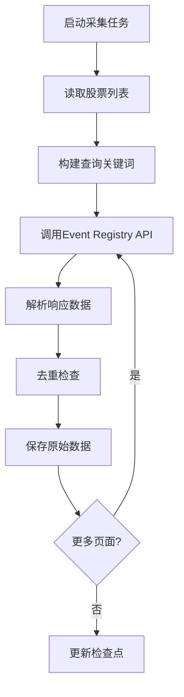
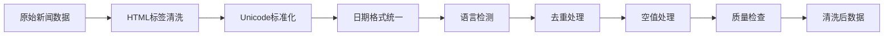

# 数据来源与清洗流程文档
# Data Lineage & Cleaning Pipeline Documentation

**文档版本**: 1.0  
**更新日期**: 2026-02-07  
**适用范围**: NLP Sentiment Factor Project

---

## 1. 数据来源总览

### 1.1 数据供应商

| 数据类型 | 供应商 | API/访问方式 | 更新频率 | 覆盖范围 |
|:---------|:-------|:-------------|:---------|:---------|
| 新闻数据 | **Event Registry** | REST API (newsapi.ai) | 实时 | 全球金融新闻 |
| 股价数据 | **Yahoo Finance** | yfinance Python库 | 日度 | 港股全量 |
| 股票列表 | **Hang Seng Indexes** | 官网下载 | 季度 | 恒生综合指数 |

### 1.2 Event Registry API 详细说明

**供应商**: Event Registry (https://eventregistry.org/)  
**API文档**: https://newsapi.ai/documentation  
**数据覆盖**: 200,000+ 全球新闻源，含中文/英文财经媒体  
**历史数据**: 2014年至今  
**API限制**: 
- 近期数据（30天内）: 1 token/page
- 历史数据: 5 tokens/year/page
- 每页最多100篇文章

**认证方式**:
```bash
export ER_API_KEY="your_api_key_here"
```

**主要数据字段**:
| 字段 | 类型 | 说明 | 示例 |
|:-----|:-----|:-----|:-----|
| uri | string | 唯一标识符 | 1234567890 |
| url | string | 原文链接 | https://... |
| title | string | 标题 | "Tencent reports Q3 earnings..." |
| body | string | 正文内容 | Full article text... |
| date | string | 发布日期 | 2024-01-15 |
| time | string | 发布时间 | 09:30:00 |
| source.title | string | 来源媒体 | "Bloomberg" |
| lang | string | 语言代码 | "eng" / "zho" |

### 1.3 Yahoo Finance 数据说明

**库**: yfinance (https://pypi.org/project/yfinance/)  
**数据源**: Yahoo Finance  
**覆盖范围**: 港股所有上市股票（.HK后缀）  
**数据字段**:
| 字段 | 说明 |
|:-----|:-----|
| date | 交易日期 |
| open | 开盘价 |
| high | 最高价 |
| low | 最低价 |
| close | 收盘价 |
| volume | 成交量 |
| adjusted_close | 调整后收盘价 |

---

## 2. 数据采集流程

### 2.1 新闻数据采集



**采集脚本**: `src/data_pipe.py`

**命令示例**:
```bash
# 采集近期数据（最近30天）
python src/data_pipe.py --symbols 0700.HK 9988.HK --recent_pages 5

# 采集历史数据
python src/data_pipe.py --symbols 0700.HK --years 2023 2024 --archive_pages 3

# 采集全股票池
python src/data_pipe.py --universe_file data/universe/hstech_current_constituents.csv \
    --years 2023 2024 --archive_pages 2
```

**输出文件**:
```
news_out/
├── articles_recent.jsonl    # 近期数据（JSON Lines格式）
├── articles_recent.csv      # 近期数据（CSV格式）
├── articles_archive.jsonl   # 历史数据（JSON Lines格式）
├── articles_archive.csv     # 历史数据（CSV格式）
├── checkpoint.json          # 断点续传状态
└── seen_uris.jsonl          # 已采集文章URI记录
```

### 2.2 股价数据采集

**采集脚本**: `src/download_hk_prices.py`

**流程**:
1. 读取股票列表（恒生综合指数成分股）
2. 调用yfinance API获取日度OHLCV数据
3. 数据验证和清洗
4. 保存为CSV格式

**输出**: `data/prices.csv`

---

## 3. 数据清洗流程

### 3.1 清洗流程概览



### 3.2 清洗步骤详解

**清洗脚本**: `src/clean_data.py`

#### 步骤1: HTML标签清洗
```python
def clean_html_tags(text: str) -> str:
    """去除HTML标签和实体字符"""
    text = html.unescape(text)  # 解码HTML实体
    text = re.sub(r'<[^>]+>', '', text)  # 去除HTML标签
    text = re.sub(r'\s+', ' ', text)  # 规范化空白
    return text.strip()
```

**处理内容**: title, body字段

#### 步骤2: Unicode标准化
```python
def normalize_unicode(text: str) -> str:
    """标准化Unicode字符"""
    text = unicodedata.normalize('NFKC', text)
    # 去除控制字符（保留换行和制表符）
    text = ''.join(char for char in text 
                   if unicodedata.category(char)[0] != 'C' 
                   or char in '\n\t')
    return text
```

#### 步骤3: 日期格式统一
```python
def normalize_datetime(date_str: str, time_str: str = None) -> Optional[datetime]:
    """统一日期时间格式为ISO 8601"""
    try:
        if time_str:
            datetime_str = f"{date_str} {time_str}"
            return datetime.strptime(datetime_str, "%Y-%m-%d %H:%M:%S")
        else:
            return datetime.strptime(date_str, "%Y-%m-%d")
    except (ValueError, TypeError):
        return None
```

#### 步骤4: 语言检测
```python
def detect_language(text: str) -> str:
    """
    基于字符类型的简单语言检测
    返回: 'zh'(中文), 'en'(英文), 'ko'(韩文), 'other'(其他)
    """
    chinese_chars = len(re.findall(r'[\u4e00-\u9fff]', text))
    korean_chars = len(re.findall(r'[\uac00-\ud7af]', text))
    english_chars = len(re.findall(r'[a-zA-Z]', text))
    total_chars = len(text)
    
    if chinese_chars / total_chars > 0.3:
        return 'zh'
    elif korean_chars / total_chars > 0.3:
        return 'ko'
    elif english_chars / total_chars > 0.5:
        return 'en'
    else:
        return 'other'
```

#### 步骤5: 去重处理
- **去重键**: uri（主键）+ url（备用）+ title（辅助）
- **策略**: 保留首次出现的记录
- **实现**: 基于checkpoint的增量去重

#### 步骤6: 空值处理
| 字段 | 空值处理策略 |
|:-----|:-------------|
| body | 删除记录（body长度<10字符） |
| title | 使用空字符串填充 |
| date | 删除记录 |
| source | 使用"Unknown"填充 |

#### 步骤7: 质量检查
```python
def validate_data_quality(df: pd.DataFrame) -> Dict[str, Any]:
    """数据质量检查报告"""
    return {
        'total_rows': len(df),
        'missing_values': {...},  # 各字段缺失值统计
        'empty_content': int,     # 空内容记录数
        'invalid_dates': int,     # 无效日期记录数
        'language_distribution': {...}  # 语言分布统计
    }
```

### 3.3 清洗命令

```bash
# 清洗CSV格式数据
python src/clean_data.py --input news_out/articles_recent.csv \
    --output_dir data/processed \
    --format csv

# 清洗JSON Lines格式数据
python src/clean_data.py --input news_out/articles_archive.jsonl \
    --output_dir data/processed \
    --format json
```

### 3.4 清洗后数据字段

| 字段 | 类型 | 说明 | 来源 |
|:-----|:-----|:-----|:-----|
| uri | string | 唯一标识符 | 原始 |
| url | string | 原文链接 | 原始 |
| title | string | 清洗后标题 | 清洗 |
| body | string | 清洗后正文 | 清洗 |
| date | date | 发布日期 | 标准化 |
| datetime_clean | datetime | 完整时间戳 | 标准化 |
| source_title | string | 来源媒体 | 原始 |
| lang | string | API返回语言 | 原始 |
| detected_lang | string | 检测语言 | 新增 |
| target | string | 关联股票代码 | 原始 |

---

## 4. 数据血缘追踪

### 4.1 数据血缘图

```
┌─────────────────────────────────────────────────────────────────┐
│                        原始数据源                                │
├─────────────────┬─────────────────┬─────────────────────────────┤
│  Event Registry │  Yahoo Finance  │  Hang Seng Indexes          │
│  (新闻API)       │  (股价数据)      │  (成分股列表)                │
└────────┬────────┴────────┬────────┴──────────────┬──────────────┘
         │                 │                       │
         ▼                 ▼                       ▼
┌─────────────────┐ ┌─────────────────┐ ┌─────────────────────────┐
│ articles_recent │ │    prices.csv   │ │ hstech_constituents.csv │
│ articles_archive│ │                 │ │                         │
└────────┬────────┘ └────────┬────────┘ └────────────┬────────────┘
         │                   │                       │
         ▼                   ▼                       │
┌─────────────────────────────────────┐              │
│      src/clean_data.py (清洗)        │              │
└────────┬────────────────────────────┘              │
         │                                          │
         ▼                                          ▼
┌─────────────────────────────────────────────────────────────────┐
│                    data/processed/                               │
│  ┌─────────────────────┐  ┌─────────────────────────────────────┐
│  │ articles_cleaned.csv│  │ articles_with_sentiment.csv         │
│  └──────────┬──────────┘  │  (清洗+情感分析)                     │
│             │             └──────────────┬──────────────────────┘
│             │                            │
│             ▼                            ▼
│  ┌─────────────────────┐  ┌─────────────────────────────────────┐
│  │  src/sentiment.py   │  │ src/generate_factors.py             │
│  │  (情感分析)          │  │  (因子生成)                          │
│  └──────────┬──────────┘  └──────────────┬──────────────────────┘
│             │                            │
│             └────────────┬───────────────┘
│                          ▼
│  ┌─────────────────────────────────────────────────────────────┐
│  │              data/processed/                                 │
│  │  ┌─────────────────┐ ┌─────────────────┐ ┌────────────────┐ │
│  │  │ daily_sentiment │ │   ic_results    │ │ factor_eval    │ │
│  │  │   _factors.csv  │ │    .csv         │ │   .json        │ │
│  │  └─────────────────┘ └─────────────────┘ └────────────────┘ │
│  └─────────────────────────────────────────────────────────────┘
└─────────────────────────────────────────────────────────────────┘
```

### 4.2 数据版本控制

| 数据阶段 | 文件命名规范 | 版本标识 |
|:---------|:-------------|:---------|
| 原始数据 | `{source}_{type}_{timestamp}.{ext}` | 采集时间戳 |
| 清洗数据 | `{source}_cleaned_{date}.{ext}` | 清洗日期 |
| 分析数据 | `{analysis}_{date}.{ext}` | 分析日期 |
| 因子数据 | `daily_sentiment_factors_{date}.csv` | 生成日期 |

### 4.3 数据质量指标

| 指标 | 目标值 | 监控频率 |
|:-----|:-------|:---------|
| 数据完整性 | >99% | 每日 |
| 去重率 | <5% | 每周 |
| 语言分布稳定性 | 变化<10% | 每月 |
| 源覆盖率 | >95% | 每月 |

---

## 5. 合规与审计

### 5.1 数据使用合规

- **Event Registry**: 遵守API使用条款，不重新分发原始数据
- **Yahoo Finance**: 仅用于研究目的，遵守Yahoo使用政策
- **数据保留**: 原始数据保留2年，清洗后数据保留5年

### 5.2 审计日志

所有数据处理操作记录到 `logs/data_pipeline.log`:
- 采集时间、数量、来源
- 清洗前后记录数对比
- 异常情况和处理措施

---

## 6. 故障排查

### 6.1 常见问题

| 问题 | 可能原因 | 解决方案 |
|:-----|:---------|:---------|
| API返回空数据 | 配额耗尽/查询条件过严 | 检查token余额，放宽查询条件 |
| 数据重复率高 | checkpoint未正确更新 | 删除checkpoint重新采集 |
| 日期解析失败 | 格式不一致 | 检查原始数据格式 |
| 语言检测错误 | 混合语言文本 | 增加上下文判断 |

### 6.2 联系支持

- Event Registry API支持: support@eventregistry.org
- 项目技术问题: 提交GitHub Issue
