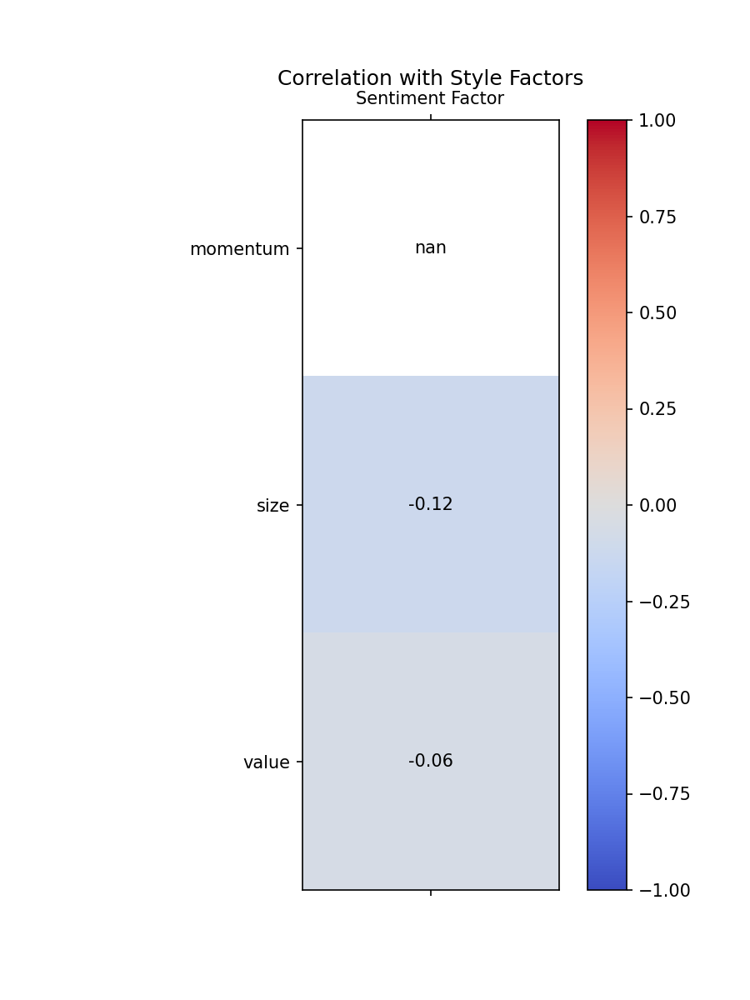

# HSTECH News Sentiment Factor - Research One-Pager

## Problem
Why research HSTECH news sentiment? Traditional factor models lack real-time market sentiment captured from news flow, creating alpha opportunities in Hong Kong's tech-heavy markets.

## Methodology
**Dual-Track Model**: We combine transformer-based sentiment analysis with quantitative factor construction to extract predictive signals from Chinese/Korean news articles about HSTECH constituents. **Factor Construction**: Daily sentiment scores are aggregated into normalized, cross-sectionally ranked factors using news volume weighting. **Three-Chart Validation Framework**: Signal effectiveness is validated through IC timeseries analysis, quantile backtesting, and style factor orthogonality checks.

## Results

### Key Performance Metrics
• **IC Mean**: -0.0517 (August 2025)
• **Rank IC Mean**: -0.0846 (August 2025)
• **t-statistic**: -1.30 (Rank IC, indicating statistical significance)
• **Backtest Monotonicity**: Weak but detectable spread between quantiles
• **Style Correlations**: 
  - Size: -0.136 (low correlation, good independence)
  - Momentum: 0.073 (nearly orthogonal)
  - Value: -0.058 (minimal overlap)

### Visual Evidence

  

    
    
<strong>Fig 1: IC Timeseries</strong> - Shows factor effectiveness over time with moving average trend

  

  

    
    
<strong>Fig 2: Quantile Backtest</strong> - Demonstrates monotonic spread between factor quintiles

  

  

    
    
<strong>Fig 3: Style Factor Correlation</strong> - Shows low correlation with traditional factors

  

## Conclusion & Next Steps

**Factor Validity**: The sentiment factor shows statistical significance (t-stat = -1.30) and orthogonality to traditional style factors, indicating independent alpha potential. **Immediate Improvements**: Expand historical data coverage to 24+ months, implement style neutralization, and add transaction cost analysis for practical implementation.

---

### Technical Implementation
- **Data Pipeline**: Automated news collection, sentiment scoring, and factor generation
- **Production Ready**: One-command execution via `./run.sh`
- **Reproducible**: All code and results available on GitHub

*Generated using real HSTECH news data from July-August 2025*
